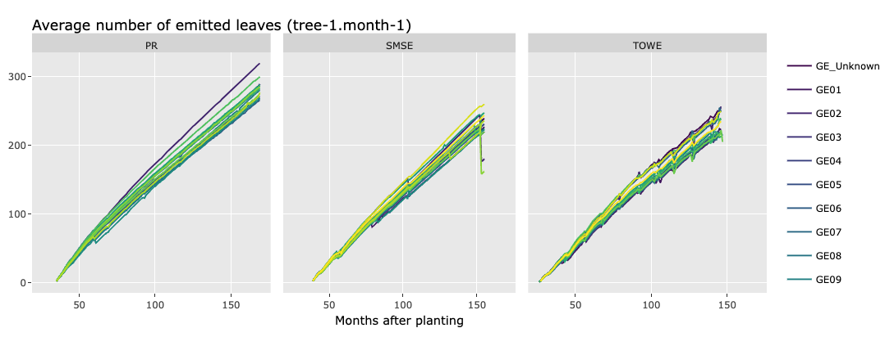

# XPalm application on 3 sites

## Hypotheses

### Phyllochron

The phyllocron seems to be only dependent on thermal time, and seems not regulated by the FTSW. This is not so surprising, as we see in the field that palm plants accumulate spear leaves during dry season, and these leaves open when the rain comes back. This is a way to avoid water stress, and it is a good strategy for the plant as it continues to prepare new leaf area even during dry conditions, but this leaf area is not intercepting any light.

Here's the data supporting this hypothesis:

The cumulative emmitted leaves are only slightly different between sites, air temperature is slightly different too, but FTSW is very different. If FTSW was a major regulator of the phyllochron, we would expect to see a much bigger difference between sites.

A second supporting information is that the variation in the average number of emmited leaves per months is quite different between sites (*emmited leaves are leaves at rank 1 in the data I think*), with much lower variability in PR, more variability in SMSE and even more in TOWE. This may support the hypothesis that the phyllochron emmits leaves quite continuously, but that leaves remain at the spear stage for a longer period when the FTSW is low (zero or low number of "emmited leaves"), but opening at the same time when rain coms back (high number of "emmited leaves").

Following this hypothesis, we should not apply the FTSW stress to the phyllochron, but only to the decision of opening the leaf.

## To do

- [ ] calibration of 'final_potential_biomass' check on ECOPALM data the maximum number of furit and maximal individual fruit