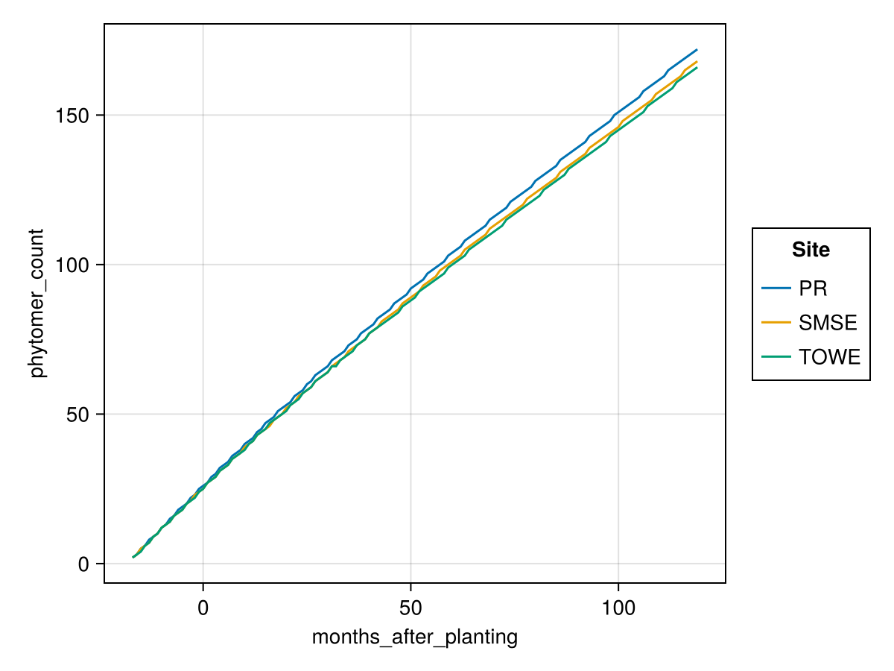
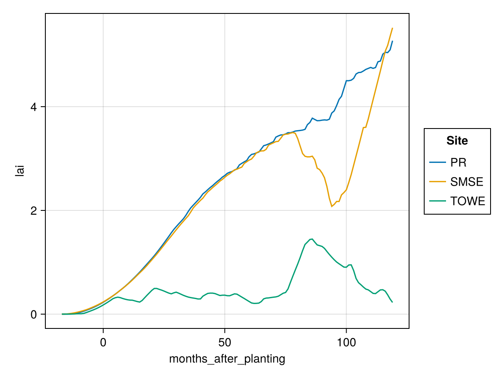

# XPalm application on 3 sites

## Hypotheses

### Phyllochron

The phyllocron seems to be only dependent on thermal time, and seems not regulated by the FTSW. This is not so surprising, as we see in the field that palm plants accumulate spear leaves during dry season, and these leaves open when the rain comes back. This is a way to avoid water stress, and it is a good strategy for the plant as it continues to prepare new leaf area even during dry conditions, but this leaf area is not intercepting any light.

Here's the data supporting this hypothesis:

The cumulative emmitted leaves are only slightly different between sites, air temperature is slightly different too, but FTSW is very different. If FTSW was a major regulator of the phyllochron, we would expect to see a much bigger difference between sites.

A second supporting information is that the variation in the average number of emmited leaves per months is quite different between sites (*emmited leaves are leaves at rank 1 in the data I think*), with much lower variability in PR, more variability in SMSE and even more in TOWE. This may support the hypothesis that the phyllochron emmits leaves quite continuously, but that leaves remain at the spear stage for a longer period when the FTSW is low (zero or low number of "emmited leaves"), but opening at the same time when rain coms back (high number of "emmited leaves").

Following this hypothesis, we should not apply the FTSW stress to the phyllochron, but only to the decision of opening the leaf.

### To do

- [ ] See issue: https://github.com/PalmStudio/XPalm.jl/issues/27
- [x] Check that un-opened leaves are not counted in the LAI: see https://github.com/PalmStudio/XPalm.jl/pull/24
- [ ] The stresses from the FTSW are applied in many places, but it could be applied twice because it is already applied to `TEff`. This was the case with the phyllochron were we had phylo_slow that represented the stress effect on the phyllochron, and we also had TEff. We should work on that. We basically have two solutions:
  1. We could remove the stress from the TEff and keep it only in the phyllochron and other processes directly. This would probably be the most logical solution, as it would allow to apply different stresses to different processes, and to modulate the effect of stresses as we want.
  2. We could only use the TEff modulated by ftsw, it would simplify the code of many models, but we can't apply a different stress to the different processes then.

I'm trying to test solution 1. I just did the first step, to compute TEff without the stress. I can see the effect on the phyllochron (it is only slightly different thanks a to a little difference in Tair between sites).

But I can't see the effect on the LAI yet:

It is still way too low for TOWE...

TODO -> I now have to try to apply the stress only to the processes. I could also generalise the concept of stresses, with e.g. water stress, nitrogen stress... that would take a value between 0 and 1, and would be applied with a given sensitivity to the different processes. This would allow to have a more flexible model, and to easily add new stresses.